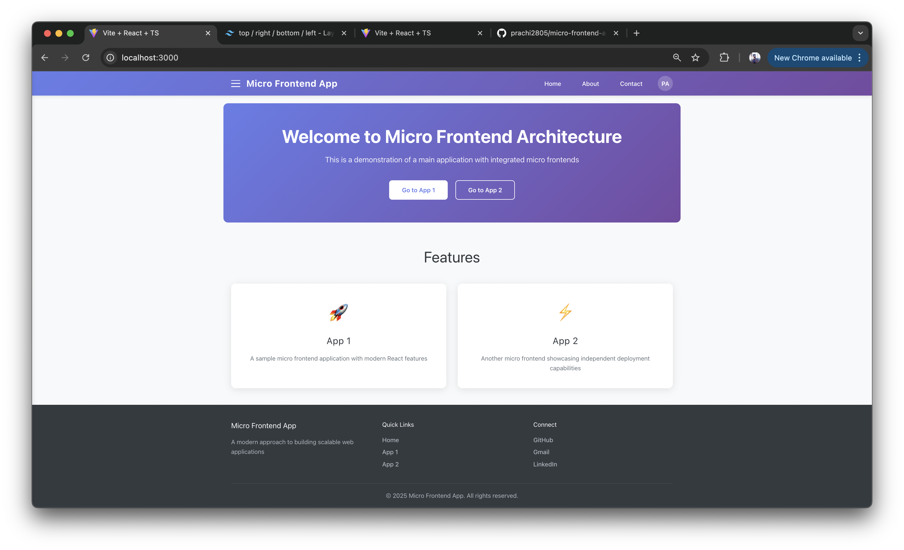
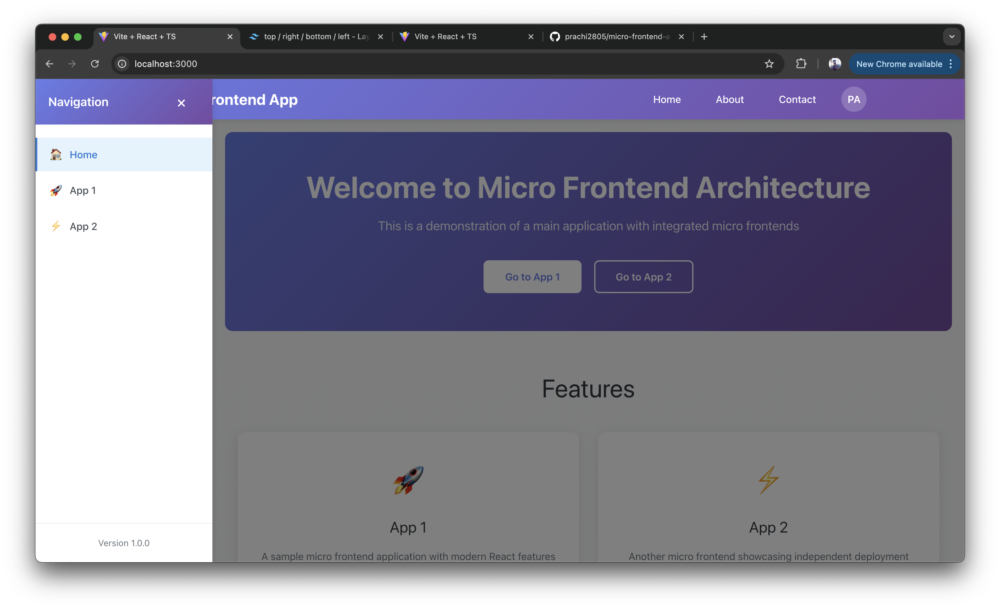
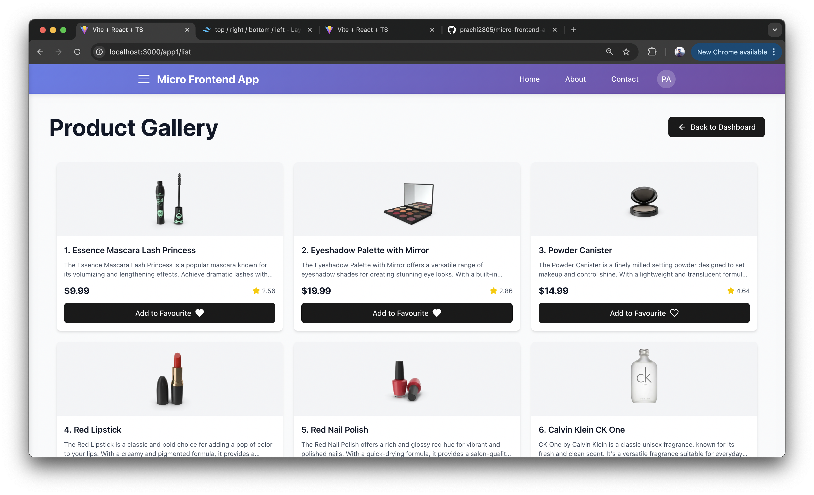
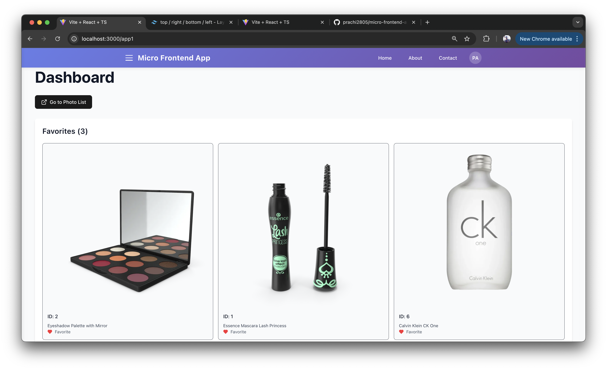
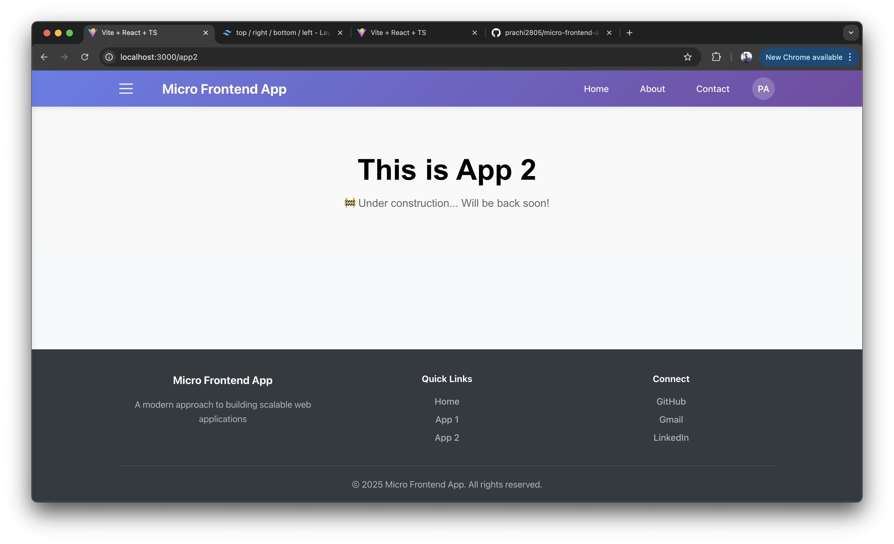

# Micro-Frontend Starter

React micro-frontend setup using Vite and Module Federation.

## 📂 Project Structure

```bash
├── main-app/       # Main Container(host)
├── app1/           # Photo gallery app
└── app2/           # Placeholder app
```

## 🛠 Setup

### Prerequisites

- Node.js v20.19.0

### Installation

```bash
# Install dependencies
cd main-app && npm i
cd app1 && npm i
cd app2 && npm i
```

```bash
# Build & run on Local
cd app1 && npm run build && npm run preview
cd app2 && npm run build && npm run preview
cd main-app && npm run dev
```

## 🚀 Live Demo






